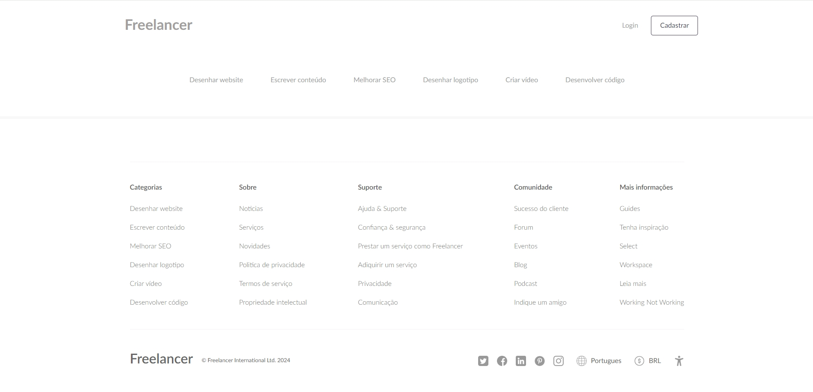
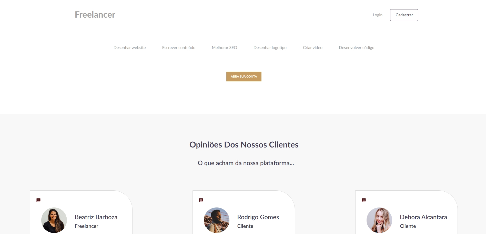
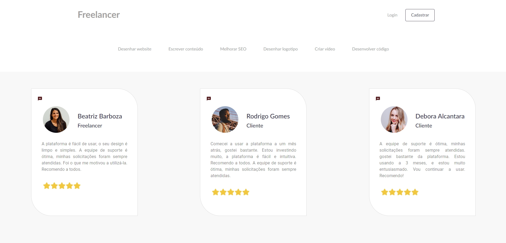

# **API SOLID Freelancer**
## **Escopo do produto**
O Projeto Freelancer consiste em um sistema web onde profissionais freelancers podem oferecer seus serviços a clientes da plataforma. Todas as funcionalidades do Sistema foram pensadas e elaboradas para proporcionar facilidade e comodidade aos usuários da plataforma.

O Sistema tem o objetivo de listar os serviços oferecidos pelos profissionais e efetuar o gerenciamento destes. Possibilitando ao profissional o controle dos mesmos. O cliente poderá consultar, adiquirir e avaliar serviços. O Sistema garante o total controle dos registros de solicitações, transações, avaliações e entregas. 

Os usuários do sistema são o Profissional Freelancer, o Cliente e o Administrador. Todos possuem acesso ao sistema e a seu respectivo espaço. Além disso, o Sistema conta com uma tela inicial que permite ao público navegar de modo simples através de filtros entre categorias e serviços.

A API foi desenvolvida utilizando os Principios do SOLID, utilizando TYPESCRIPT com NODEJS, EXPRESSJS e Banco de dados MONGODB. Foi realizada a integração com a plataforma de pagamentos STRIPE, documentação utilizando o SWAGGER e o JEST nos testes unitários.
<br/>
<br/>
O Front-End foi desenvolvido utilizando o REACTJS em TYPESCRIPT com layout responsivo, Material UI, Styled-components e reduxjs/toolkit. E está disponível para consulta no link abaixo:

```
https://github.com/danielbarbozadasilva/freelancer-service-frontend
```
<br/>


## **Instalação com Docker**
Clone o repositório na pasta de sua preferência.
```
git clone https://github.com/danielbarbozadasilva/freelancer-service-backend-solid
```

Abra a pasta do repositório clonado, e crie um arquivo ".env", exemplo:
```
PORT=3011
NODE_ENV=production

MONGO_USER=user01
MONGO_PASS=pFh7Ed2am1
MONGO_HOST=localhost:27017
MONGO_DB_NAME=freelancer-api
MONGO_INITDB_DATABASE=freelancer-api

JWT_SECRET=6a60c0b6-6a7d-11ed-a1eb-0242ac120002
JWT_REFRESH_SECRET=825850e4-6a7d-11ed-a1eb-0242ac120002
JWT_VALID_TIME=999999999999999

URL=http://localhost:3000
IMAGE_PATH=http://localhost:3011/static/
EMAIL=daniel80barboza@gmail.com

STRIPE=exemplo

NODEMAILER_HOST=exemplo
NODEMAILER_PORT=exemplo
NODEMAILER_USER=exemplo
NODEMAILER_PASS=exemplo
```

Abra a pasta do repositório clonado, e crie um arquivo ".env.test", exemplo:
```
PORT=3011
NODE_ENV=development

MONGO_USER=user01
MONGO_PASS=pFh7Ed2am1
MONGO_HOST=localhost:27017
MONGO_DB_NAME=freelancer-api
MONGO_INITDB_DATABASE=freelancer-api

JWT_SECRET=6a60c0b6-6a7d-11ed-a1eb-0242ac120002
JWT_REFRESH_SECRET=825850e4-6a7d-11ed-a1eb-0242ac120002
JWT_VALID_TIME=999999999999999

URL=http://localhost:3000
IMAGE_PATH=http://localhost:3011/static/
EMAIL=daniel80barboza@gmail.com

STRIPE=exemplo

NODEMAILER_HOST=exemplo
NODEMAILER_PORT=exemplo
NODEMAILER_USER=exemplo
NODEMAILER_PASS=exemplo
```


Abra a pasta do repositório clonado, e instale as dependências do projeto através do comando:
```
npm install
```

Logo após o término da instalação. Instale o Docker e o docker compose através do link: 
```
https://docs.docker.com/desktop/windows/install/
```
Com o Docker instalado, abra o terminal na pasta do projeto e execute o seguinte comando:
```
docker-compose up
``` 

Observação: ao subir o container, o Docker executará automaticamente a migração dos 'seeders'. Que estão localizados na pasta docker-entrypoint-initdb.d -> mongo-init.sh

Execute o comando para rodar o projeto:
```
npm run dev
```

Execute o comando para rodar os testes unitários:
```
npm run test:unit
```


Com o projeto rodando, abra a documentação do Swagger:
```
http://localhost:3011/api-docs/
```

Com o projeto rodando, abra a documentação do Postman na pasta do projeto:
```
docs -> API-FREELANCE.postman_collection.json
```
<br/>
<br/>


## **Requisitos funcionais**
<br/>

RF001 – O sistema deve controlar a autenticação dos usuários.

RF002 – O sistema deve manter cadastro de usuários.

RF003 – O sistema deve manter solicitações.

RF004 – O sistema deve alterar o status de solicitações.

RF005 – O sistema deve enviar e-mail confirmando a mudança de status na etapa da aquisição do serviço.

RF006 – O sistema deve enviar e-mail confirmando o registro do usuário.

RF007 – O sistema deve alterar o status do usuário.

RF008 – O sistema deve filtrar os serviços.

RF009 – O sistema deve manter usuários.

RF010 – O sistema deve manter serviços.

RF011 – O sistema deve manter categorias.

RF012 – O sistema deve controlar avaliação de serviços.

RF013 – O sistema deve controlar a aquisição de serviços.

RF014 – O sistema deve exibir os serviços por categoria.

RF015 – O sistema deve listar os serviços por ordem alfabética ou ordem de preço.

<br/>
<br/>

## **Requisitos não funcionais**
<br/>

| Identificação | Classificação | Descrição |
| --- | --- | --- |
|RNF001   |Implementação     | O back-end do sistema deve ser desenvolvido em TYPESCRIPT utilizando o NODEJS e EXPRESSJS.    |
|RNF002   |Implementação     | O back-end do sistema deve ser desenvolvido utilizando os principios do SOLID.    |
|RNF003   |Usabilidade     | O sistema deve integrar-se com a plataforma STRIPE.    |
|RNF004   |Implementação     | O front-end do sistema deve ser desenvolvido em REACTJS.    |
|RNF005   |Implementação     | O banco de dados a ser utilizado é o MONGODB.     |
|RNF006   |Implementação     | O sistema deve funcionar em Sistemas Operacionais Windows e Linux.    |
|  |  |  |

<br/>
<br/>

## **Regras de negócio**
<br/>

| Identificação | Classificação | Descrição |
| --- | --- | --- |
|RN001   |Controle de acesso     |Os acessos permitidos ao sistema serão: Administrador, Freelancer e Cliente. O usuário anônimo terá acesso apenas ao portal do site.    |
|RN002   |Recuperação de senha    | Para recuperar a senha, o Cliente deverá informar o token recebido por e-mail.     |
|RN003   |Controle de veracidade      | Para que um serviço possa ser adquirido, este deverá estar cadastrado no sistema.   |
|RN004   |Limite de ação     | Somente o Administrador terá permissão para incluir e alterar as categorias no sistema.    |
|RN005   |Limite de ação     | Somente o Freelancer terá permissão para incluir e alterar os seus serviços no sistema.   |
|RN006   |Limite de ação     | Somente o Cliente poderá solicitar serviços no sistema.   |
|RN007   |Limite de ação     | O Cliente poderá visualizar apenas os dados da sua conta. Tais como: pedidos e mensagens.  |
|RN008   |Limite de ação     | Apenas o Administrador poderá visualizar informações, solicitações e histórico de pedidos de todos os usuários    |
|  |  |  |

<br/>
<br/>

> ## Licença
- Licença GPLv3
<br/>
<br/>

> ## Metodologias e Padrões
* RESTful
* SOLID
* Conventional commits
* GitFlow
* Error handler

<br/>
<br/>
<br/>

> ## Bibliotecas e Ferramentas
* Docker
* Mongoose
* Stripe
* Jest
* Nodemailer
* Swagger
* Git
* Crypto
* Path
* Joi
* Nodemon
* JsonWebToken
* Express
* Eslint
* Prettier
* Multer
<br/>
<br/>
<br/>

> ## **Transações**
<br/>

## **Processar pagamento - Cliente**
Ao realizar uma compra o Sistema envia um e-mail notificando o Cliente sobre o processamento do pagamento.

<br/>

<br/>
<br/>
<br/>
<br/>

## **Processar pagamento - Administrador**
Quando o Cliente realiza uma compra, o Sistema envia um e-mail notificando ao administrador sobre o pedido. 

<br/>

<br/>
<br/>
<br/>
<br/>

## **Pagamento aprovado - Cliente**
Quando o cliente realiza o pagamento, e este é aprovado pelo PagSeguro. O Sistema envia um e-mail ao Cliente notificando que o pedido foi pago.

<br/>

<br/>
<br/>
<br/>
<br/>

## **Pagamento aprovado - Administrador**
Quando o pagamento é aprovado pelo PagSeguro. O Sistema envia um e-mail ao Administrador para que este separe e envie os produtos referentes ao pedido.

<br/>

<br/>
<br/>
<br/>
<br/>

## **Pagamento cancelado - Cliente**
Quando o cliente não realiza o pagamento, o Sistema envia um e-mail ao Cliente notificando que o seu pedido não foi pago, e por isso foi cancelado.

<br/>

<br/>
<br/>
<br/>
<br/>

## **Envio do pedido - Cliente**
Quando o Administrador envia o pedido para a transportadora. O Sistema notifica o Cliente e informa o código de rastreamento.

<br/>

<br/>
<br/>
<br/>
<br/>

> ## **Telas**
<br/>

## **Portal - Tela Inicial**
<br/>

<br/>
<br/>
<br/>
<br/>

## **Portal - Tela de login**
<br/>

<br/>
<br/>
<br/>
<br/>

## **Cliente - Recuperar senha**
<br/>

<br/>
<br/>
<br/>
<br/>

## **Portal - Redefinir senha**
<br/>

<br/>
<br/>
<br/>
<br/>

## **Portal - Tela de cadastro**
<br/>

<br/>
<br/>
<br/>
<br/>

## **Portal - Tela detalhes do produto**
<br/>

<br/>
<br/>
<br/>
<br/>

## **Portal - Tela de carrinho**
<br/>

<br/>
<br/>
<br/>
<br/>

## **Portal - Finalizar pedido**
<br/>

<br/>
<br/>
<br/>
<br/>


## **Portal - Pedido concluído**
<br/>

<br/>
<br/>
<br/>
<br/>

## **Portal - Imprimir boleto**
<br/>

<br/>
<br/>
<br/>
<br/>

## **Dashboard Cliente - Atualizar cadastro**
<br/>

<br/>
<br/>
<br/>
<br/>

## **Dashboard Cliente - listar pedidos**
<br/>

<br/>
<br/>
<br/>
<br/>

## **Dashboard Cliente - listar os produtos por pedido**
<br/>

<br/>
<br/>
<br/>
<br/>

## **Dashboard Cliente - listar os dados de entrega por pedido**
<br/>

<br/>
<br/>
<br/>
<br/>

## **Dashboard Cliente - Buscar por pedidos**
<br/>

<br/>
<br/>
<br/>
<br/>

## **Dashboard Admin - Listar pedidos dos clientes**
<br/>

<br/>
<br/>
<br/>
<br/>

## **Dashboard Admin - Listar produtos referentes aos pedidos**
<br/>

<br/>
<br/>
<br/>
<br/>

## **Dashboard Admin - Listar dados do cliente que efetuou o pedido**
<br/>

<br/>
<br/>
<br/>
<br/>

## **Dashboard Admin - Listar dados de entrega do pedido**
<br/>

<br/>
<br/>
<br/>
<br/>

## **Dashboard Admin - Buscar por um pedido específico**
<br/>

<br/>
<br/>
<br/>
<br/>

## **Dashboard Admin - Listar categorias cadastradas**
<br/>

<br/>
<br/>
<br/>
<br/>

## **Dashboard Admin - Listar produtos referentes a categoria**
<br/>

<br/>
<br/>
<br/>
<br/>

## **Dashboard Admin - Cadastrar nova categoria**
<br/>

<br/>
<br/>
<br/>
<br/>

## **Dashboard Admin - Editar categoria**
<br/>

<br/>
<br/>
<br/>
<br/>

## **Dashboard Admin - Remover a categoria e os seus respectivos produtos**
<br/>

<br/>
<br/>
<br/>
<br/>

## **Dashboard Admin - Listar produtos cadastrados**
<br/>

<br/>
<br/>
<br/>
<br/>

## **Dashboard Admin - Cadastrar novo produto**
<br/>

<br/>
<br/>
<br/>
<br/>

## **Dashboard Admin - Editar produto**
<br/>

<br/>
<br/>
<br/>
<br/>

## **Dashboard Admin - Excluir produto**
<br/>

<br/>
<br/>
<br/>
<br/>

## **Dashboard Admin - Buscar por produto**
<br/>

<br/>
<br/>
<br/>
<br/>

## **Dashboard Admin - Listar clientes cadastrados**
<br/>

<br/>
<br/>
<br/>
<br/>

## **Dashboard Admin - Listar endereço do cliente**
<br/>

<br/>
<br/>
<br/>
<br/>

## **Dashboard Admin - Excluir cliente**
<br/>

<br/>
<br/>
<br/>
<br/>

## **Dashboard Admin - Buscar por cliente**
<br/>

<br/>
<br/>
<br/>
<br/>

## **Dashboard Admin - Listar avaliações**
<br/>

<br/>
<br/>
<br/>
<br/>

## **Dashboard Admin - Excluir avaliação**
<br/>

<br/>
<br/>
<br/>
<br/>
